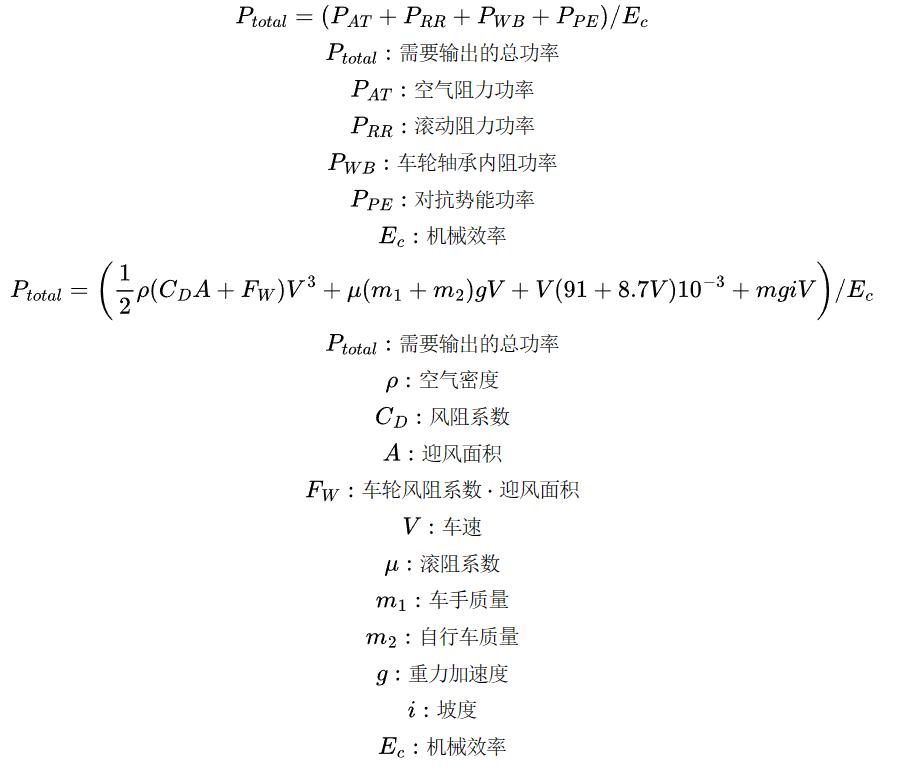

* 软件功能：
    * 计算不同牙盘和飞轮齿数之间搭配的齿比，以及其变化趋势；
    * 计算各种档位对应的踏频-车速关系，以及各种车速下，变速所带来的踏频变化；
    * 计算各种坡度下，车手各种姿势维持某车速和所需输出的功率的函数对应关系；
    * 计算某齿比设定下，车手能够骑行的最大爬坡度。
* 计算说明：
    * 功率-车速曲线：该项计算结果只适用于大组赛公路车，其中的手变位、下把位等各种姿势下的功率包含轮胎及轴承滚阻功率、克服重力做功功率、空气阻力功率、机械损耗功率，上方的蓝色滑动条可选择对应的坡度，数值为负值表示下坡，此时部分曲线将位于y=0下方，表示此时的车速放坡需要刹车才能维持车速不变，且对应的功率的绝对值为刹车的功率，曲线和y=0的焦点对应的车速即为该坡度滑行所能达到的最大车速。计算公式及数据参考期刊论文——<a target='_blank' href='https://www.aliyundrive.com/s/rcujcipbs4W'>《Aerodynamic performance and riding posture in road cycling and triathlon》</a>，文中参与实验的车手为70kg（身高未提及，图片目测180cm+），车架为某大组赛公路车爬坡车架，轮组为某30mm低框铝轮，实验所用的空气阻力系数和迎风面积可能与实际个体数据差异较大，计算所得的功率仅供参考。参与实验的数据为：
        * 滚动阻力系数：0.005
        * 传动效率：0.976
        * 空气密度：1.2kg/m³
        * 轮组转动空阻系数·迎风面积：0.0044m²
        * 手变位空阻系数·迎风面积：0.343m²
        * 下把位空阻系数·迎风面积：0.332m²
        * 下把位(曲肘)空阻系数·迎风面积：0.306m²
        * 手变位(曲肘)空阻系数·迎风面积：0.295m²
        * TT位空阻系数·迎风面积：0.289m²
    * 最小齿比爬坡曲线：该曲线主要用于分析车辆的最大爬坡能力，因此为了方便函数图像显示简洁，该爬坡曲线仅计算最小齿比。计算所得的功率由单位时间的上升高度、风阻、轮胎滚阻、车轮轴承滚阻计算所得，机械效率取0.976，重力加速度取9.8m/s²，风阻、滚阻计算方式同功率-车速曲线，其中风阻以手变位的骑行姿势计算。
* 计算公式：
    * 
* 版本：
    * v2.0.2
        * 新功能
            * 添加更多飞轮预设
            * 功率-车速曲线中，添加视图缩放滑块
    * v2.0.1
        * 修复
            * 功率-车速曲线中，大小盘选择按钮文字描述修改
            * 修复最小齿比爬坡曲线和齿比曲线中，悬浮提示框数据描述与曲线反序
            * 修复手机端界面左右浮动
            * 修复抽屉及echarts容器的响应式
    * v2.0.0
        * 新功能
            * 添加更多自定义参数
            * 添加双盘选项
            * 添加计算公式图
            * 优化页面布局
            * 增加手机端视图宽度
    * v1.1.1
        * 新功能
            * 修正风阻计算结果
            * 修改计算方法及数据描述
    * v1.1.0
        * 新功能
            * 添加功率-车速曲线中的下坡曲线
            * 添加响应式布局
    * v1.0.0
        * 新功能
            * 不同牙盘和飞轮齿数之间搭配的齿比，以及其变化趋势；
            * 各种档位对应的踏频-车速关系，以及各种车速下，变速所带来的踏频变化；
            * 各种坡度下，车手各种姿势维持某车速和所需输出的功率的函数对应关系；
            * 某齿比设定下，车手能够骑行的最大爬坡度
* 抖音：
    * 
* 打赏：
    * 
* 反馈：<a href='mailto:1326981297@qq.com?subject=诺比单车分析-信息反馈&body=（如存在bug，请截图说明;如需添新的牙盘或飞轮选项，请提供官网数据截图。）' target='_blank' style='color: var(--c-text-lighter);'>1326981297@qq.com</a>

